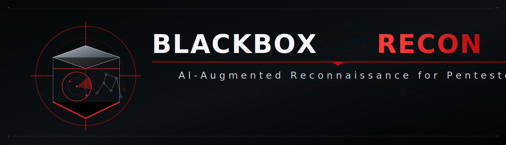

<p align="center">
  
</p>

<p align="center">
  <strong>AI-Augmented Reconnaissance for Pentesters</strong><br>
  Evidence-driven reconnaissance for professional operators.
</p>

<p align="center">
  <a href="https://github.com/TheW4rF4ther/blackbox-recon/releases"></a>
  <a href="https://www.python.org/"></a>
  <a href="LICENSE"></a>
</p>

<p align="center">
  <em>by <a href="https://blackboxintelgroup.com">Blackbox Intelligence Group LLC</a></em>
</p>

---

## What is Blackbox Recon?

**Blackbox Recon** is an AI-augmented reconnaissance framework for authorized security testing, external attack-surface review, and red-team preparation. It runs Kali-friendly reconnaissance workflows, normalizes evidence, generates deterministic findings, and optionally enriches results with local or hosted LLMs.

Unlike traditional recon tools that dump raw output, Blackbox Recon emphasizes:

- **Evidence-backed findings** with stable IDs and traceable evidence records
- **Deterministic reporting** so client-facing facts do not depend on model prose
- **PTES-style execution tracing** with command provenance
- **Kali-native tooling** such as Nmap, nslookup, gobuster, and dirb
- **Pluggable AI enrichment** for OpenAI, Claude, LM Studio-compatible local models, and Ollama
- **Engagement gates** for scoped, authorized execution outside lab mode

---

## Quick Start

### Installation

```bash
git clone https://github.com/TheW4rF4ther/blackbox-recon.git
cd blackbox-recon
pip install -e .
blackbox-recon --help
```

### Lab run

```bash
blackbox-recon --target example.com --full --lab
```

### Local AI enrichment

```bash
blackbox-recon \
  --target example.com \
  --full \
  --lab \
  --ai-mode local \
  --local-url http://localhost:1234/v1
```

### Engagement-gated run

```bash
blackbox-recon \
  --target corp.example.com \
  --engagement ./engagement.yaml \
  --modules subdomain,portscan,technology
```

---

## Recon Pipeline

Blackbox Recon currently supports a structured reconnaissance flow:

| Phase | Purpose | Example tooling |
|---|---|---|
| M1 | Attack surface mapping / DNS names | Python DNS resolution and HTTP probe |
| M2 | DNS intelligence | `nslookup` |
| M3 | Network service enumeration | `nmap -p- -A --open` or TCP connect fallback |
| M4 | Web content discovery | `gobuster` or `dirb` |
| M5 | Technology identification | Python requests + header/body heuristics |

Each run produces structured JSON containing:

- `recon_phase_trace`
- `evidence_package`
- `deterministic_findings`
- `deterministic_attack_paths`
- `technical_report_markdown`
- optional `ai_analysis`

---

## AI Model Behavior

Blackbox Recon treats AI as an **enrichment layer**, not the source of truth.

The deterministic engine owns:

- observations
- evidence records
- finding IDs
- severity/status
- attack-path scaffolding
- report facts

The AI layer may provide:

- executive summary wording
- risk narrative polish
- caveat wording
- advisory next-step suggestions

For local/Ollama models, structured JSON enrichment is validated and can be omitted from the console unless `--show-ai-narrative` is provided.

---

## Configuration

Create a default config:

```bash
blackbox-recon --init-config
```

Common config location:

```text
~/.blackbox-recon/config.yaml
```

Useful environment variables:

```bash
export OPENAI_API_KEY="sk-..."
export ANTHROPIC_API_KEY="sk-ant-..."
export BLACKBOX_RECON_LAB=1
export BLACKBOX_RECON_DIR_WORDLIST=/usr/share/wordlists/dirb/common.txt
```

---

## Command Reference

| Command | Description |
|---|---|
| `blackbox-recon --target DOMAIN --lab` | Run in lab mode without engagement gates |
| `blackbox-recon --target DOMAIN --full --lab` | Run full configured recon in lab mode |
| `blackbox-recon --target DOMAIN --ai-mode local --local-url http://localhost:1234/v1 --lab` | Run with local LLM enrichment |
| `blackbox-recon --target DOMAIN --modules subdomain,portscan` | Run selected modules |
| `blackbox-recon --target DOMAIN -o report.md --format markdown --lab` | Write a Markdown report |
| `blackbox-recon kali-setup` | Check Kali/Debian toolchain readiness |

---

## Output Philosophy

Blackbox Recon is designed around one rule:

> The recon engine owns the evidence. The AI enriches interpretation. The report renderer controls the deliverable.

That means client-facing findings should remain stable and evidence-backed even when an LLM is unavailable, noisy, or disabled.

---

## About Blackbox Intelligence Group

**Blackbox Intelligence Group LLC** is a veteran-owned cybersecurity firm specializing in offensive security, managed defense, and practical security operations.

- Website: https://blackboxintelgroup.com
- GitHub: https://github.com/TheW4rF4ther

---

## Legal Notice

**Blackbox Recon is for authorized security testing only.**

Only use this tool against systems you own or have explicit written authorization to assess. Respect scope boundaries, rules of engagement, rate limits, and applicable laws.

---

<p align="center">
  <strong>Built for operators who need evidence, not noise.</strong>
</p>
