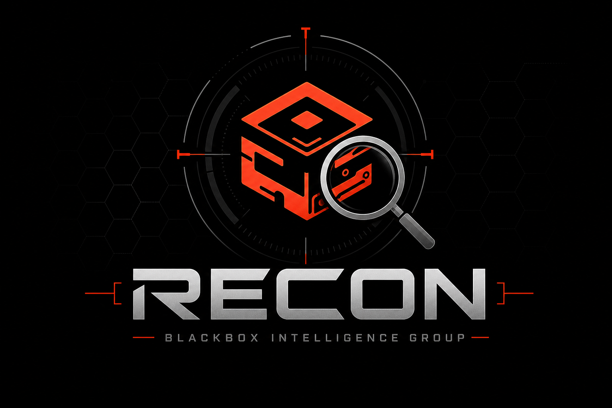

<div align="center">
  
  
  # 🔍 Blackbox Recon
  
  **AI-Augmented Reconnaissance for Penetration Testers**
  
  [](https://github.com/TheW4rF4ther/blackbox-recon/releases)
  [](https://www.python.org/)
  [](LICENSE)
  
  *by [Blackbox Intelligence Group LLC](https://blackboxintelgroup.com)*
</div>

---

## 🎯 What is Blackbox Recon?

**Blackbox Recon** transforms raw reconnaissance data into **actionable intelligence**. Unlike traditional recon tools that overwhelm you with data, Blackbox Recon:

- 🤖 **AI-Powered Analysis** - Correlates findings and suggests attack paths
- 🎯 **Smart Prioritization** - Ranks vulnerabilities by exploitability
- 🔗 **Attack Chain Mapping** - Shows how vulnerabilities connect
- ⚡ **Pluggable AI** - Works with OpenAI, Claude, or your local LLM
- 🎨 **Beautiful Output** - Rich terminal UI with progress indicators

---

## 🚀 Quick Start (60 Seconds)

### Installation
```bash
# Clone the repository
git clone https://github.com/TheW4rF4ther/blackbox-recon.git
cd blackbox-recon

# Install
pip install -e .

# Verify installation
blackbox-recon --help
```

### Your First Scan
```bash
# Basic reconnaissance
blackbox-recon --target example.com

# With AI analysis using your local LLM
blackbox-recon --target example.com --ai-mode local
```

---

## 📖 Detailed Usage Guide

### 1. Basic Reconnaissance

Start with a simple reconnaissance scan:

```bash
blackbox-recon --target corp.example.com
```

**What happens:**
1. Discovers subdomains (www, mail, dev, api, etc.)
2. Identifies live web services
3. Detects technologies (Apache, Nginx, WordPress, etc.)
4. Generates a structured JSON report

**Sample Output:**
```
[+] Starting reconnaissance on corp.example.com
==================================================
[+] Found 47 subdomains
[+] Discovered 12 live web services  
[+] Identified 3 technologies: Apache, PHP, WordPress
[+] Completed in 45 seconds

Results saved to: corp.example.com-recon-20250113.json
```

### 2. Full Reconnaissance with All Modules

Enable comprehensive scanning:

```bash
blackbox-recon --target corp.example.com --full
```

**Modules included:**
- ✅ **Subdomain Enumeration** - DNS brute force + discovery
- ✅ **Port Scanning** - TCP port scanning (top 1000 ports)
- ✅ **Technology Detection** - Web fingerprinting
- ✅ **Vulnerability Scanning** - Nuclei integration (coming soon)

### 3. AI-Augmented Analysis

This is where Blackbox Recon shines. The AI analyzes your recon data and provides **actionable intelligence**.

#### Using OpenAI GPT-4
```bash
# Set your API key
export OPENAI_API_KEY="sk-xxxxxxxxxxxxxxxx"

# Run with AI analysis
blackbox-recon --target corp.example.com --ai-mode openai --full
```

#### Using Claude
```bash
export ANTHROPIC_API_KEY="sk-ant-xxxxxxxxxxxxxxxx"
blackbox-recon --target corp.example.com --ai-mode claude --full
```

#### Using LM Studio (Local AI) ⭐ Recommended
```bash
# 1. Start LM Studio with your model (e.g., Qwen, Llama, etc.)
# 2. Enable API server in LM Studio settings (usually port 1234)

# Run with local AI - no API costs, total privacy
blackbox-recon --target corp.example.com --ai-mode local --local-url http://localhost:1234/v1
```

#### Using Ollama
```bash
# Start Ollama
ollama serve

# Run with Ollama
blackbox-recon --target corp.example.com --ai-mode ollama --ollama-model llama3.1
```

---

## 🎓 How It Works

### The Reconnaissance Pipeline

```
┌─────────────────────────────────────────────────────────────┐
│                    RECONNAISSANCE PHASE                       │
├─────────────────────────────────────────────────────────────┤
│                                                             │
│  ┌──────────────┐    ┌──────────────┐    ┌──────────────┐  │
│  │  Subdomain   │───▶│  Port Scan   │───▶│  Technology │  │
│  │ Enumeration  │    │   (Nmap)     │    │  Detection   │  │
│  └──────────────┘    └──────────────┘    └──────────────┘  │
│         │                   │                   │            │
│         ▼                   ▼                   ▼            │
│  ┌──────────────────────────────────────────────────────┐  │
│  │              RAW RECON DATA                          │  │
│  │  • 47 subdomains found                             │  │
│  │  • 12 open ports (80, 443, 8080, 3306...)          │  │
│  │  • Technologies: Apache, PHP, WordPress            │  │
│  └──────────────────────────────────────────────────────┘  │
│                          │                                  │
└──────────────────────────┼──────────────────────────────────┘
                           │
                           ▼
┌─────────────────────────────────────────────────────────────┐
│                    AI ANALYSIS PHASE                        │
├─────────────────────────────────────────────────────────────┤
│                                                             │
│  🤖 AI analyzes the data and produces:                      │
│                                                             │
│  ┌──────────────────────────────────────────────────────┐  │
│  │  EXECUTIVE SUMMARY                                  │  │
│  │  Attack surface identified with 3 critical          │  │
│  │  vulnerabilities requiring immediate attention.     │  │
│  └──────────────────────────────────────────────────────┘  │
│                                                             │
│  ┌──────────────────────────────────────────────────────┐  │
│  │  PRIORITIZED FINDINGS                               │  │
│  │  🔴 HIGH: Jenkins exposed (CVE-2024-23897)         │  │
│  │  🔴 HIGH: SMB signing disabled                      │  │
│  │  🟡 MEDIUM: WordPress outdated                      │  │
│  └──────────────────────────────────────────────────────┘  │
│                                                             │
│  ┌──────────────────────────────────────────────────────┐  │
│  │  ATTACK PATHS                                       │  │
│  │  Path 1: Jenkins → RCE → Internal Access             │  │
│  │  Path 2: SMB Relay → Domain Compromise               │  │
│  └──────────────────────────────────────────────────────┘  │
│                                                             │
└─────────────────────────────────────────────────────────────┘
```

### What the AI Analyzes

The AI receives all reconnaissance data and analyzes:

1. **Technology Stack Risks**
   - Outdated software versions
   - Dangerous configurations
   - Known CVE associations

2. **Attack Surface Correlation**
   - "Jenkins on dev server + weak authentication = entry point"
   - "SMB signing disabled + NTLM = relay attacks possible"

3. **Exploitation Chains**
   - Entry points → Lateral movement → Privilege escalation
   - Realistic attack paths based on findings

4. **Risk Prioritization**
   - HIGH: Direct exploitation possible
   - MEDIUM: Requires chaining or conditions
   - LOW: Informational, harder to exploit

---

## 📊 Example Output

### Without AI (Standard Recon)
```json
{
  "target": "corp.example.com",
  "subdomains": [
    {"subdomain": "www.corp.example.com", "ip": "203.0.113.10"},
    {"subdomain": "dev.corp.example.com", "ip": "203.0.113.20"},
    {"subdomain": "jenkins.corp.example.com", "ip": "203.0.113.21"}
  ],
  "ports": [
    {"port": 80, "service": "http"},
    {"port": 443, "service": "https"},
    {"port": 8080, "service": "http-proxy"}
  ],
  "technologies": [
    {"name": "Apache", "version": "2.4.41"},
    {"name": "Jenkins", "version": "2.426.1"},
    {"name": "WordPress", "version": "6.2.2"}
  ]
}
```

### With AI Analysis
```
┌─────────────────────────────────────────────────────────────┐
│ AI ANALYSIS RESULTS                                         │
├─────────────────────────────────────────────────────────────┤
│                                                             │
│ EXECUTIVE SUMMARY                                           │
│ The target exhibits a significant attack surface with      │
│ multiple entry points. The exposed Jenkins instance on     │
│ the development server represents the highest risk.        │
│                                                             │
│ PRIORITIZED FINDINGS                                        │
│ 🔴 HIGH  jenkins.corp.example.com:8080                     │
│          Jenkins 2.426.1 vulnerable to CVE-2024-23897      │
│          (Arbitrary file read → RCE)                       │
│          Remediation: Upgrade to 2.426.2+                  │
│                                                             │
│ 🔴 HIGH  SMB (Port 445) on 203.0.113.20                    │
│          SMB signing disabled                              │
│          NTLM relay attacks possible                       │
│          Remediation: Enable SMB signing                   │
│                                                             │
│ 🟡 MEDIUM WordPress 6.2.2 on blog.corp.example.com         │
│          3 security updates behind                         │
│          Remediation: Update to 6.4.3                      │
│                                                             │
│ ATTACK PATH 1: Quick Domain Compromise                    │
│ 1. Exploit Jenkins CVE-2024-23897 → Code execution         │
│ 2. Extract credentials from Jenkins scripts                │
│ 3. SMB relay attack against Domain Admin                   │
│ 4. Full Active Directory compromise                        │
│                                                             │
│ CONFIDENCE: 87%                                            │
└─────────────────────────────────────────────────────────────┘
```

---

## ⚙️ Configuration

### Create Default Config
```bash
blackbox-recon --init-config
```

This creates `~/.blackbox-recon/config.yaml`:

```yaml
# AI Provider Settings
ai:
  provider: openai        # openai, claude, local, ollama
  api_key: null           # Or use env var: OPENAI_API_KEY
  model: gpt-4
  temperature: 0.3
  max_tokens: 4000

# Local LLM (LM Studio, etc.)
local:
  url: http://localhost:1234/v1
  model: qwen2.5-9b-instruct

# Recon Settings
recon:
  threads: 50
  timeout: 30
  ports: top1000          # top100, top1000, all, or "80,443,8080"

# Modules
modules:
  - subdomain
  - portscan
  - technology

output_format: json
verbose: false
```

### Environment Variables
```bash
# API Keys (recommended over config file)
export OPENAI_API_KEY="sk-xxxxxxxxxxxxxxxx"
export ANTHROPIC_API_KEY="sk-ant-xxxxxxxxxxxxxxxx"
```

---

## 🛠️ Command Reference

| Command | Description |
|---------|-------------|
| `blackbox-recon --target DOMAIN` | Basic reconnaissance |
| `blackbox-recon --target DOMAIN --full` | Full scan all modules |
| `blackbox-recon --target DOMAIN --ai-mode openai` | With AI analysis |
| `blackbox-recon --target DOMAIN --modules subdomain,portscan` | Specific modules |
| `blackbox-recon --target DOMAIN -o report.md --format markdown` | Markdown output |
| `blackbox-recon --init-config` | Create default config |

### Module Options
- `subdomain` - DNS enumeration
- `portscan` - TCP port scanning
- `technology` - Web fingerprinting
- `vulnscan` - Vulnerability scanning (coming soon)

### AI Modes
- `openai` - OpenAI GPT-4/GPT-3.5
- `claude` - Anthropic Claude
- `local` - Local LLM via HTTP (LM Studio, etc.)
- `ollama` - Ollama local models

---

## 🏢 About Blackbox Intelligence Group

**Blackbox Intelligence Group LLC** is a veteran-owned cybersecurity firm specializing in offensive security and managed defense.

### Our Services
- 🛡️ **24/7 SOC** with BlackboxEDR platform
- 🔴 **Penetration Testing** (Internal, External, Web App)
- 🎯 **Red Team Operations** - Realistic adversary simulation
- 📊 **Vulnerability Assessments** with ERIP prioritization
- 💼 **Cybersecurity Consultation**

**Website:** https://blackboxintelgroup.com  
**Email:** info@blackboxintelgroup.com  
**GitHub:** https://github.com/TheW4rF4ther

---

## 🤝 Contributing

We welcome contributions! See [CONTRIBUTING.md](CONTRIBUTING.md) for guidelines.

## 📄 License

MIT License - See [LICENSE](LICENSE)

## ⚠️ Legal Notice

**Blackbox Recon is for authorized security testing only.**

- Only use on systems you own or have **explicit written authorization** to test
- Respect scope boundaries
- Follow responsible disclosure practices
- Check local laws regarding security testing

---

<div align="center">

**⭐ Star this repo if you find it useful!**

Built with ❤️ by the offensive security experts at Blackbox Intelligence Group

</div>
